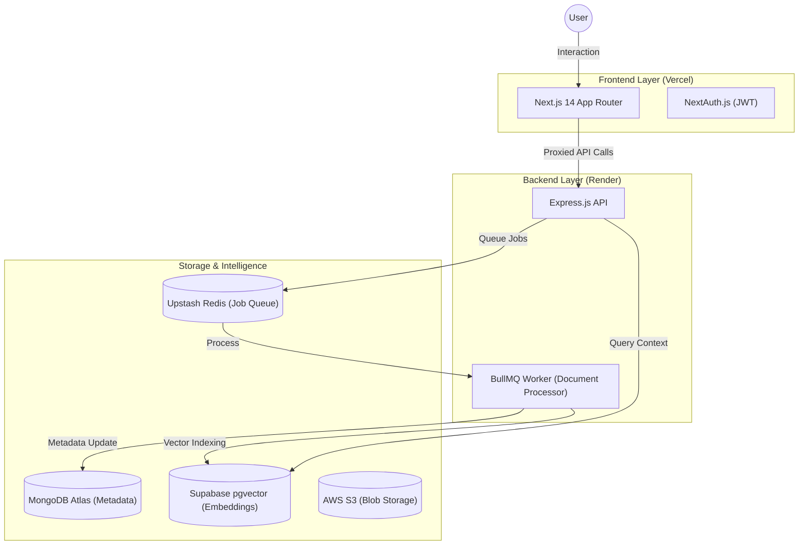

# NeuroVault: Intelligent RAG Knowledge Base 🧠🚀

**NeuroVault** is a sophisticated, full-stack monorepo application designed to solve the "context window" limitation in modern AI. By leveraging a high-performance **Retrieval-Augmented Generation (RAG)** pipeline, it allows users to upload, index, and chat with their PDF documents and YouTube transcripts in real-time.

[](./DEPLOYMENT.md)
[](#tech-stack)

---

## 🏛 Technical Architecture

The project is structured as a **Decoupled Monorepo** using **npm Workspaces**. This architecture allows for independent scaling of the UI and the heavy-duty processing backend.



---

## 🌟 Key Technical Features

### 📡 Advanced RAG Pipeline
- **Semantic Search**: Implemented using **HuggingFace** embeddings and **pgvector** similarity search (`cosine_distance`).
- **Contextual Chunking**: Smart text splitting with overlap to preserve semantic context during retrieval.
- **Multi-Source Ingestion**: Highly robust processing of PDFs and YouTube transcripts (via `yt-caption-kit`).

### ⚙️ Asynchronous Task Management
- **BullMQ Orchestration**: Document processing is handled by an isolated background worker, ensuring the main API remains responsive.
- **Graceful Failure**: Automatic retries and refined error logging for failed AI indexing jobs.

### 🛡️ Enterprise-Grade Security
- **JWT Auth Bridge**: Custom middleware to verify NextAuth tokens between the decoupled frontend and backend.
- **Rate Limiting**: Custom implementation to protect AI endpoints from abuse.
- **Resource Constraints**: Strict Multer file-size limits and payload validation.

---

## 🛠 Tech Stack

- **Frontend**: Next.js 14, Tailwind CSS, Framer Motion, Lucide React.
- **Backend**: Node.js, Express.js, tsup (Production Bundling).
- **Automation**: BullMQ, Redis.
- **Database**: MongoDB (Metadata), Supabase pgvector (Vector Store).
- **DevOps**: Docker (Multi-stage builds), Docker Compose, GitHub Actions.

---

## 🚀 Getting Started

### Prerequisites
- Node.js 20+
- MongoDB, Redis, and Supabase instances.

### Installation
```bash
npm install
```

### Development
```bash
# Run both Frontend and Backend concurrently
npm run dev
```

---

## 🌍 Scalable Deployment

NeuroVault is "Deployment Ready" for any cloud provider. We recommend:
- **Frontend**: [Vercel](https://vercel.com)
- **Backend/Worker**: [Render](https://render.com)

See the **[Full Deployment Guide](./DEPLOYMENT.md)** for step-by-step setup instructions.

---

## 👨‍💻 Engineering Standards
- **Clean Code**: Adherence to Domain-Driven Design for shared logic.
- **Type Safety**: End-to-end TypeScript coverage from models to UI.
- **Operations**: Multi-stage Docker optimization to reduce image sizes by ~60%.

---

*Built with passion for building future-proof AI applications.*
