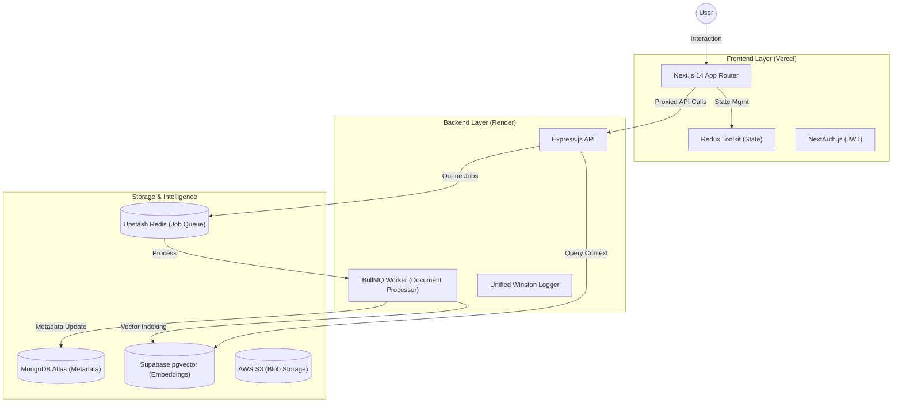

# NeuroVault: Intelligent RAG Knowledge Base 🧠🚀

**NeuroVault** is a sophisticated, full-stack monorepo application designed to solve the "context window" limitation in modern AI. By leveraging a high-performance **Retrieval-Augmented Generation (RAG)** pipeline, it allows users to upload, index, and chat with their PDF documents and YouTube transcripts in real-time.

[](./DEPLOYMENT.md)
[](#tech-stack)

---

## 🏛 Technical Architecture

The project is structured as a **Decoupled Monorepo** using **npm Workspaces**. This architecture allows for independent scaling of the UI and the heavy-duty processing backend.



---

## 🌟 Key Technical Features

### 📡 Advanced RAG Pipeline
- **Semantic Search**: Implemented using **HuggingFace** embeddings and **pgvector** similarity search (`cosine_distance`).
- **Contextual Chunking**: Smart text splitting with overlap to preserve semantic context during retrieval.
- **AI Processing**: Automated metadata extraction, topic tagging (3-5 tags), and 3-sentence summaries for every document.

### ⚙️ Asynchronous Task Management
- **BullMQ Orchestration**: Document processing is handled by an isolated background worker, ensuring the main API remains responsive even during heavy file indexing.
- **Redis Resilience**: Custom logic to handle cloud-provider idle timeouts (`ECONNRESET`) with automated, silent reconnection.

### 🛡️ Enterprise-Grade Security
- **JWT Auth Bridge**: Custom middleware to verify NextAuth sessions between the decoupled frontend and backend.
- **Rate Limiting**: Strict checking on sensitive AI routes to protect against resource abuse.
- **Input Validation**: Centralized environment validation and strict MongoDB ID checks.

---

## 🛠 Tech Stack

- **Frontend**: Next.js 14, **Redux Toolkit**, Tailwind CSS, Framer Motion.
- **Backend**: Node.js, Express.js, tsup (Production Bundling).
- **Automation**: BullMQ, Redis.
- **Database**: MongoDB (Metadata), Supabase pgvector (Vector Store).
- **Testing**: **Playwright** (End-to-End Testing).
- **DevOps**: GitHub Actions CI/CD.

---

## 🚀 Getting Started

### Prerequisites
- Node.js 20+
- MongoDB, Redis (Upstash), and Supabase instances.

### Installation
```bash
npm install
```

### Development
```bash
# Run Frontend, Backend, and Shared in parallel
npm run dev
```

### Testing
```bash
# Run Playwright E2E Tests
npm run test:e2e -w @neurovault/frontend
```

---

## 🌍 Scalable Deployment

NeuroVault is "Deployment Ready" for any cloud provider. We recommend:
- **Frontend**: [Vercel](https://vercel.com)
- **Backend/Worker**: [Render](https://render.com)

See the **[Full Deployment Guide](./DEPLOYMENT.md)** for step-by-step setup instructions.

---

## 👨‍💻 Engineering Standards
- **Monorepo Structure**: Shared logic, types, and services reside in `packages/shared`.
- **Type Safety**: End-to-end TypeScript coverage from database models to React components.
- **Observability**: Centralized logging system with context-aware error tracking.

---

*Built with passion for building future-proof AI applications.*
